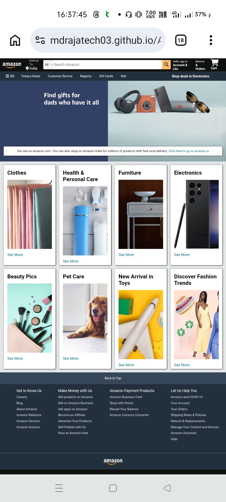

# 🚀 Amazon Clone 

A sleek, professional, and fully responsive web application built using **HTML5, CSS3, and Vanilla JavaScript**. This project focuses on providing a seamless user experience with clean code and modern design principles.

## [Live Project](https://mdrajatech03.github.io/Amazon-Clone/)

## ✨ Key Features

* **Responsive Design:** Optimized for all devices including Mobile, Tablet, and Desktop.
* **Modern UI/UX:** Clean interface with smooth transitions and hover effects.
* **Interactive Elements:** Fully functional logic built with Vanilla JavaScript.
* **Fast Loading:** Lightweight and optimized for performance.

---

## 

## 🛠️ Tech Stack

* **HTML5:** Semantic structure for better SEO and accessibility.
* **CSS3:** Custom styling, Flexbox/Grid layouts, and animations.
* **JavaScript (ES6+):** Dynamic DOM manipulation and core application logic.

---

## ⚙️ Installation & Usage
**1. Clone the Repository:**

git clone [https://github.com/mdrajatech03/](https://github.com/mdrajatech03/)Amazon-Clone.git

**2. Navigate to Folder:**

cd Amazon-Clone

## 🌐 Live Demo
Check out the live version here:
👉 https://mdrajatech03.github.io/Amazon-Clone/

## 👤 Author
**Md Raja**

**GitHub:** @mdrajatech03

**LinkedIn:** (https://vaai.la/MdrajaLinkedIn)

## 📄 License
This project is licensed under the MIT License.
